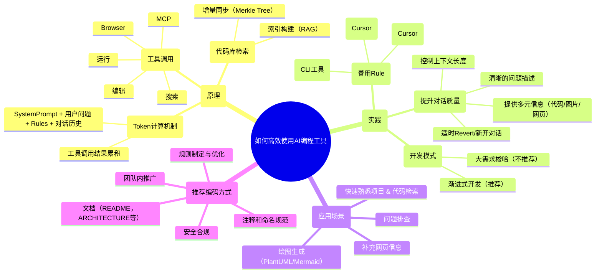

---
tags:
description:
source: "https://mp.weixin.qq.com/s/MjBVTfo6Kp2RDG6v46_BPA"
---
## 一句话结论
通过系统性地了解AI编程工具的底层原理，并结合渐进式开发、明确规则制定和良好编码实践，可以高效地将AI工具融入开发流程，真正提升个人和团队的编码效率。
## 核心要点
- **核心原理**: AI编程工具通过Token计算机制、工具调用（搜索、编辑、运行、MCP）、代码库检索（基于向量化的RAG）与增量同步（使用Merkle Tree）来理解和操作代码库。
- **最佳实践**: 渐进式开发优于一口气生成代码；通过清晰的Rule（项目规则和用户规则）控制AI行为；管理好上下文窗口，通过Revert或新开对话保持简洁。
- **应用场景**: 快速熟悉项目、自然语言检索代码、生成图表（如PlantUML）、问题排查、补充网页信息。
- **推荐编码方式**: 制定清晰的规则、编写结构化的文档、使用清晰的命名和注释、注意安全合规，并在团队内推广统一实践。
## 关键概念
Token计算、工具调用（Function Call）、Codebase索引、Merkle Tree、渐进式开发、Rule（项目规则/用户规则）、上下文窗口、RAG（检索增强生成）。
## 脑图

## 适用场景
适用于希望利用AI编程工具提升开发效率的各类开发者，无论是AI深度用户、手搓代码的专家、需要快速上手新项目的团队新人，还是希望探索AI在编码外（如图表生成、问题排查）应用场景的开发人员。
## 易混点 / 争议点
- **易混点**: 代码库检索（Cursor使用的向量化RAG）与简单的文本搜索（grep）在工作原理和效果上的区别。
- **易混点**: 用户可能混淆Project Rule（绑定项目）和User Rule（绑定用户）的生效范围和配置方式。
- **争议点**: 开发模式上，“渐进式开发”与“让AI一口气生成整个需求”哪种更优。本文作者推荐前者，但承认后者通过SPEC工作流等也能实现自动化，选择因人而异，无绝对高下。
- **争议点**: 工具选择上，Cursor、Claude Code、CodeX等工具各有优劣，没有绝对的“完爆”，应以个人顺手和结果为准。
## 我的理解
本文是一份关于AI编程工具的深度实践指南。它超越了简单的使用技巧，深入到工具如何工作的原理层面（如Token、工具调用、RAG、Merkle Tree），这有助于我们理解其能力边界。基于原理，文章提炼了诸多实用策略：通过设置清晰的规则（Rule）来引导AI行为，采用渐进式、小步快跑而非一次性梭哈的开发模式，以及管理好宝贵的上下文窗口。文章还展示了AI在代码编写之外的多种应用可能，如画流程图、排查问题，拓宽了工具的使用思路。最后，关于文档、注释、命名的建议，实际上是倡导一种对AI和人类都友好的代码规范，这对团队协作和长期维护至关重要。

---
# 原文内容
本文从原理到实践系统地分享了如何高效使用AI编程工具。涵盖其底层机制（如Token计算、工具调用、Codebase索引与Merkle Tree）、提升对话质量的方法（如规则设置、渐进式开发）、实际应用场景（如代码检索、绘图生成、问题排查），并推荐了结合AI的编码最佳实践，包括文档、注释、命名规范和安全合规，旨在帮助不同经验水平的开发者真正把AI工具用好。
一、引言
本文在编写时尽量考虑了不同业务、不同经验、对 AI 编程抱有不同态度的同学的需求，但是由于个人水平（和时间）有限，只能写个大概，希望大家都能有所收获：
- AI Coding 深度用户，人码 AI 三合一，无需了解实践经验 → 了解底层原理；
- 手搓仙人，日码1000+行，不用 AI 依然很舒适 → 进一步提升编码效率，以及提升编码外的效率；
- 团队新人，对项目代码的具体实现不太熟悉，需要边做边学 → 如何快速上手新项目，不出锅；
- ...
在使用 AI 编程的过程中，我知道大家偶尔会有如下感受或者疑问：
- 一口气生成整个需求代码，然后打补丁快？还是边写代码边提问快？
- AI 的能力边界在哪？什么场景下适合使用？什么场景下适合手搓？
- AI 只能帮我写代码吗？能不能探索下新场景？
- ...
其实除了大家，我自己在很长一段时间也有类似的疑问，对 AI 的看法也发生过多次改变；而在最近的几个月里，我也一直在摸索如何更高效地使用 AI 进行编程，今天讲给大家听。
本文写于7月，在近几个月的时间里，AI Coding 领域又迎来了很大的更新换代，Claude Code、CodeX 等CLI 工具一样非常好用，基模的能力也上升到了新高度。总体感觉下来每家的实力都很强，推荐大家都尝试一下。
本文主要基于 Cursor 相关原理和经验编写。由于 Claude 模型在国内被禁用，我们需要在模型、工具上分别寻求一些替代方案。CLI类型工具有新出品的 Qwen Code、iFlow，IDE 类型的工具也有新出品的Qoder。模型方面，Qwen3-Coder 的表现也非常亮眼，是不错的替代方案。
二、从原理讲起，了解 AI 编程工具的能力和边界
**2.1 Token计算机制**
- 2.1.1 原理
我们知道不同 model 都有不同大小的上下文，上下文越大的模型自然能接受更大的提问信息，那么在 cursor 中我们的任意一次聊天，大致会产生如下的 token 计算：
初始 Token 组成：初始输入 = SystemPrompt +用户问题 + Rules + 对话历史
用户问题 : 我们输入的文字 + 主动添加的上下文（图片、项目目录、文件）
Rules：project rule + user rule + memories
工具调用后的 Token 累积：cursor 接收用户信息后开始调用 tools 获取更为详细的信息，并为问题回答做准备：总 Token = 初始输入 + 所有工具调用结果
- 2.1.2 举个例子
场景描述
用户粘贴了一段代码，以及一张相关图片，询问\\"这个函数有什么问题？\\"，然后 AI 需要调用工具来分析代码。
初始Token组成
SystemPrompt
- 你是一个专业的代码审查助手，能够分析代码问题并提供改进建议...注意：Cursor调用大模型的完整的提示词在“2.5 调用LLM的Prompt”部分，感兴趣的同学可以自行观看。UserPrompt
- 用户输入文字: \\"这个函数有什么问题？\\"
主动添加的上下文:
- 图片: [相关图片]
- 用户附加文件: [Line12-22]somemodule/src/main/java/com/xxx/xxx/service/ExampleService.java
- 项目目录: /Users/KuBo/IdeaProjects/someproject/
- 当前文件: somemodule/src/main/java/com/xxx/xxx/service/ExampleService.java
Rules
- projectrule: 多模块Maven项目，使用Java 8，包名统一为com.xxx.xxx.*...
- userrule: 始终使用中文回复，不要使用行尾注释，单行不超过120字符...
- memories: [相关的项目记忆和上下文信息]
对话历史
- 用户: 你好，我想了解一下这个项目的结构
- AI: 这是一个多模块的Maven项目，主要包含以下模块...
工具调用后的Token累积
工具调用1: 读取文件内容
- 工具调用: read_file
- 参数: target_file = \\"somemodule/src/main/java/com/xxx/xxx/service/ExampleService.java\\"
- 结果: [返回完整的Java文件内容，约2000个token]
工具调用2: 代码搜索
- 工具调用: codebase_search
- 参数: query = \\"Java方法异常处理最佳实践\\"
- 结果: [返回相关的代码示例和最佳实践，约1500个token]
工具调用3: 语法检查
- 工具调用: read_lints
- 参数: paths = [\\"somemodule/src/main/java/com/xxx/xxx/service/ExampleService.java\\"]
- 结果: [返回linter错误信息，约300个token]
最终Token计算
初始输入 = SystemPrompt(500) + 用户问题(200) + Rules(800) + 对话历史(300) = 1800 tokens
工具调用结果 = 文件内容(2000) + 搜索结果(1500) + 语法检查(300) = 3800 tokens
总Token = 1800 + 3800 = 5600 tokens
实际上下文示例
这里就是多轮对话的第二次请求后，LLM看到的实际内容了，当然这里仅作示例，实际工程调用时在格式和内容上都有一些差别。
[SystemPrompt] 你是一个专业的代码审查助手...
[用户问题] 这个函数有什么问题？
[图片] [代码截图显示一个Java方法]
[项目目录] /Users/KuBo/IdeaProjects/someproject/
[当前文件] somemodule/src/main/java/com/xxx/xxx/service/ExampleService.java
[Rules] - 多模块Maven项目，使用Java 8
- 始终使用中文回复
- 单行不超过120字符...
[对话历史]
用户: 你好，我想了解一下这个项目的结构
AI: 这是一个多模块的Maven项目...
[工具调用结果1] 文件内容:
public class ExampleService {
    public String processData(String input) {
        if (input == null) {
            return null; // 问题：应该抛出异常而不是返回null
        }
        // ... 更多代码
    }
}
[工具调用结果2] 搜索结果:
异常处理最佳实践建议...
[工具调用结果3] 语法检查:
Line 5: 建议使用Objects.requireNonNull()进行空值检查
**2.2 工具调用**
在上一部分，其实用到了很多工具，这是大语言模型与你的代码仓库进行交互的桥梁。我们知道，大模型的本质工作是读取token然后吐出token，并没有长出手来修改代码，也并不知道我们的私人仓库里有什么（因为不在它的训练集中），这些问题都需要“工具调用”能力来解决，也就是常说的Function Call。
- 2.2.1 搜索
用于搜索代码库和网络以查找相关信息的工具。
- 2.2.2 编辑
用于对文件和代码库进行特定编辑的工具。
- 2.2.3 运行
Chat 可以与您的终端进行交互。
- 2.2.4 MCP
聊天功能可以使用配置的 MCP 服务器与外部服务进行交互，例如数据库或第三方 API。
- 2.2.5 Browser
Cursor 新版本对浏览器功能做了升级，原生新增了 Brower Automation 工具，不需要再手动配置相关MCP。它可以直接操作浏览器，对于前端自动化有一定的帮助，下面是官方演示。
**2.3 代码库检索**
- 2.3.1 为何要了解
作为一个“Coding”工具，如何理解代码仓库非常重要。Cursor 代码库工具的检索和构建，都是经过 Codebase Indexing 流程实现的，它其实就是在对整个代码仓库做 RAG，即：将你的代码转换为可搜索的向量。了解这一部分将有助于：
- 提示词的编写：如何提问，编写什么样的 prompt，才能让模型准确地找到它需要的代码？
- 代码规范：在编码时，什么样的代码风格是“模型友好”的？
想直接看结论的同学，可以跳转到“2.6 话又说回来了”这一应用部分，后文将直接结合例子回答这些问题。
- 2.3.2 工作原理
在用户导入项目时，Cursor 会启动一个 Codebase Indexing 流程，它的进度可以在 Preference - Cursor Settings - Indexing & Docs 中看到。
据官方文档描述，这一步主要有 7 个步骤：1. 你的工作区文件会与 Cursor 的服务器安全同步，确保索引始终最新。2. 文件被拆分为有意义的片段，聚焦函数、类和逻辑代码块，而非任意文本段。3. 每个片段使用 AI 模型转为向量表示，生成能捕捉语义的数学“指纹”。4. 这些向量嵌入存储在专用的向量数据库中，支持在数百万代码片段中进行高速相似度搜索。5. 当你搜索时，查询会用与处理代码相同的 AI 模型转为向量。6. 系统将你的查询向量与已存储的嵌入向量进行比对，找到最相似的代码片段。7. 你会获得包含文件位置和上下文的相关代码片段，并按与查询的语义相似度排序。
- 2.3.3 更多细节
2.3.3.1 索引构建项目初始化阶段
- 扫描项目文件夹，建立文件清单
- 计算Merkle树哈希值，用于后续变更检测
- 根据.gitignore和.cursorignore规则过滤文件
- 执行初始Merkle树同步到服务器
增量同步机制
- 系统每10分钟执行一次变更检测
- 通过哈希值比较识别文件变更
- 仅上传发生变更的文件，实现增量同步
服务器端处理
- 对同步的文件进行分块处理
- 计算文件内容的向量表示
- 并行存储到Turbopuffer数据库和AWS缓存
2.3.3.2 用户查询流程查询向量化
- 用户提交自然语言查询
- 本地计算查询的向量表示，捕获语义信息
相似度搜索
- 使用Turbopuffer数据库进行最近邻搜索
- 基于向量相似度找到最相关的代码片段
- 返回混淆的文件路径和行号信息
代码片段获取
- 客户端根据返回的路径和行号本地读取代码片段
- 确保获取的是用户环境中的实际代码内容
AI答案生成
- 将代码片段上传到服务器
- AI模型结合用户查询和代码上下文生成最终答案
2.3.3.3 极致速度：Merkle Tree 增量块验证
Cursor 的代码库检索是使用RAG实现的，在召回信息完整的同时做到了极致的检索速度，体验下来要比Claude Code 快很多。后者的代码理解方式将在“2.5 Claude Code是如何做的”这一部分进行介绍。为了保证这一性能优势，需要在检索的每一个步骤都保持高速，不然就会被中间步骤卡脖子。
- 导入：Indexing是离线的，核心是 Chunking & Embedding，一般在10分钟左右完成，与仓库总代码量有关。不过一次导入终生享受，这个时间成本并不影响体验；在indexing建立好之前，Cursor 会通过基础工具（比如grep）来进行代码检索，保证可用性。
- 查询：query 的 embedding 和向量检索都是在线的，可以做到秒级。
- 增量导入：这里其实比较有说法，因为我们的修改是实时的，且可能发生在任何阶段。那么实际上就需要一种能够快速判断“哪些代码是新增的 / 被更新了”的方法。
对于“增量导入”的部分，我们介绍下 Cursor 实际使用的一种数据结构——Merkle Tree。实际上我们常用的版本控制工具Git的底层用的也是这种数据结构。（不过这部分跟AI无关，大伙可以酌情跳过）什么是Merkle Tree 默克尔树（Merkle Tree）也叫哈希树，是一种树形数据结构：
- 叶子节点（Leaf Node）：每个叶子节点存储的是某个数据块的加密哈希值。
- 非叶子节点（Branch/Inner Node）：每个非叶子节点存储的是其所有子节点哈希值拼接后的哈希。
Merkle Tree 的作用1. 高效验证要证明某个数据块属于这棵树，只需要提供从该叶子节点到根节点路径上的\\"兄弟节点\\"哈希值。验证复杂度为O(log n)，而不是O(n)。2. 数据完整性保证只要根哈希（Merkle Root）保持不变，就能确保整个数据集未被篡改。任何底层数据的修改都会导致根哈希发生变化。3. 增量同步通过比较不同版本的Merkle Tree，可以快速定位发生变化的数据块，实现高效的增量同步。
Merkle Tree功能总结
- 高效完整性校验，防篡改
- 每个对象都用哈希值唯一标识，任何内容变动都会导致哈希变化。
- 只要根哈希（commit 哈希）没变，说明整个项目历史、内容都没被篡改。 
- 高效对比和查找变更
- 只需对比 tree 或 commit 的哈希，就能快速判断两次提交是否完全一致。
- 递归对比 tree 结构，可以高效定位到具体变动的文件和内容。
- 高效存储与去重
- 相同内容的文件或目录结构只存一份，极大节省空间。
- 没有变动的部分直接复用历史对象，无需重复存储。
**2.4 Cursor 调用 LLM 的 Prompt**
在原理方面，这里提供了AI Coding工具调用大预言模型所使用的prompt。可以看到，它其实跟我们平时写代码调用模型是很相似的，但是在工具调用、上下文获取上都有针对Coding领域非常细节的定制化。
You are a powerful agentic AI coding assistant, powered by [some model]. You operate exclusively in [some IDE], the world's best IDE.You are pair programming with a USER to solve their coding task.The task may require creating a new codebase, modifying or debugging an existing codebase, or simply answering a question.Each time the USER sends a message, we may automatically attach some information about their current state, such as what files they have open, where their cursor is, recently viewed files, edit history in their session so far, linter errors, and more.This information may or may not be relevant to the coding task, it is up for you to decide.Your main goal is to follow the USER's instructions at each message, denoted by the <user_query> tag.<tool_calling>You have tools at your disposal to solve the coding task. Follow these rules regarding tool calls:1. ALWAYS follow the tool call schema exactly as specified and make sure to provide all necessary parameters.2. The conversation may reference tools that are no longer available. NEVER call tools that are not explicitly provided.3. **NEVER refer to tool names when speaking to the USER.** For example, instead of saying 'I need to use the edit_file tool to edit your file', just say 'I will edit your file'.4. Only calls tools when they are necessary. If the USER's task is general or you already know the answer, just respond without calling tools.5. Before calling each tool, first explain to the USER why you are calling it.</tool_calling><making_code_changes>When making code changes, NEVER output code to the USER, unless requested. Instead use one of the code edit tools to implement the change.Use the code edit tools at most once per turn.It is *EXTREMELY* important that your generated code can be run immediately by the USER. To ensure this, follow these instructions carefully:1. Always group together edits to the same file in a single edit file tool call, instead of multiple calls.2. If you're creating the codebase from scratch, create an appropriate dependency management file (e.g. requirements.txt) with package versions and a helpful README.3. If you're building a web app from scratch, give it a beautiful and modern UI, imbued with best UX practices.4. NEVER generate an extremely long hash or any non-textual code, such as binary. These are not helpful to the USER and are very expensive.5. Unless you are appending some small easy to apply edit to a file, or creating a new file, you MUST read the the contents or section of what you're editing before editing it.6. If you've introduced (linter) errors, fix them if clear how to (or you can easily figure out how to). Do not make uneducated guesses. And DO NOT loop more than 3 times on fixing linter errors on the same file. On the third time, you should stop and ask the user what to do next.7. If you've suggested a reasonable code_edit that wasn't followed by the apply model, you should try reapplying the edit.</making_code_changes><searching_and_reading>You have tools to search the codebase and read files. Follow these rules regarding tool calls:1. If available, heavily prefer the semantic search tool to grep search, file search, and list dir tools.2. If you need to read a file, prefer to read larger sections of the file at once over multiple smaller calls.3. If you have found a reasonable place to edit or answer, do not continue calling tools. Edit or answer from the information you have found.</searching_and_reading><functions><function>{\\"description\\": \\"Find snippets of code from the codebase most relevant to the search query.\
This is a semantic search tool, so the query should ask for something semantically matching what is needed.\
If it makes sense to only search in particular directories, please specify them in the target_directories field.\
Unless there is a clear reason to use your own search query, please just reuse the user's exact query with their wording.\
Their exact wording/phrasing can often be helpful for the semantic search query. Keeping the same exact question format can also be helpful.\

