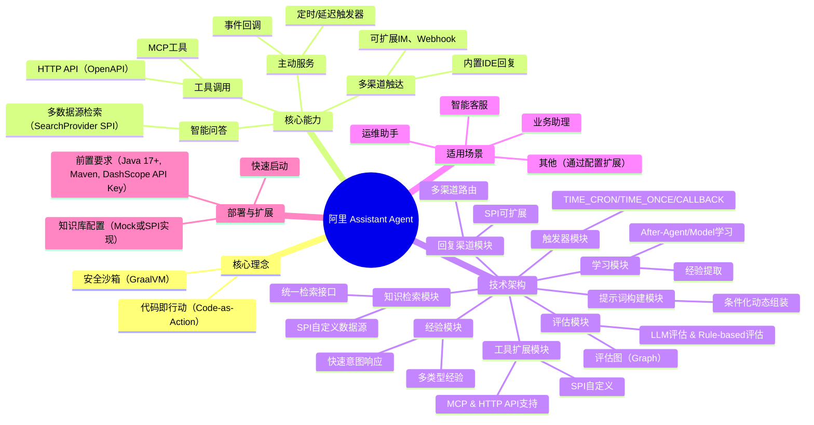

---
tags:
  - 代码即行动
  - CodeAct
description: 本文介绍了阿里巴巴开源的Assistant Agent，一个基于Spring AI Alibaba构建的企业级智能助手框架。其核心创新在于采用“代码即行动（Code-as-Action）”范式，允许Agent通过生成和执行代码来灵活编排工具、完成复杂任务，而非仅限于调用预定义API。该框架具备安全沙箱（GraalVM）、多维评估、Prompt动态组装、经验学习和快速响应等技术特性。它提供了智能问答、工具调用（支持MCP和HTTP API）、主动服务（定时/事件触发）和多渠道触达等核心能力，适用于智能客服、运维助手、业务助理等多种场景。文章详细阐述了其模块化架构，包括评估、Prompt构建、学习、经验、触发器、回复、工具扩展和知识检索等核心模块的工作原理。最后，提供了从环境准备、快速启动到知识库配置（支持Mock体验和SPI扩展）的完整部署指南。
source: https://mp.weixin.qq.com/s/gSG-xQ9XiipewiT-CDWkwA
---
## 一句话结论
阿里巴巴开源的Assistant Agent是一个基于Spring AI Alibaba构建的、采用代码即行动范式的企业级智能助手框架，旨在帮助开发者快速构建答疑、诊断等智能助手。
## 核心要点
- **核心特性**：采用代码即行动（Code-as-Action）范式、安全沙箱、多维评估、Prompt动态组装、经验学习、快速响应。
- **核心能力**：智能问答、工具调用、主动服务、多渠道触达。
- **架构设计**：模块化设计，包含评估、Prompt构建、学习、经验、触发器、回复、工具扩展、知识检索等核心模块。
- **应用场景**：适用于智能客服、运维助手、业务助理等场景。
- **部署方式**：提供快速启动指南，支持通过SPI接口扩展知识库和工具。
## 关键概念
- **代码即行动（Code-as-Action）**：Agent通过生成并执行代码来完成任务和编排工具。
- **安全沙箱**：在GraalVM多语言沙箱中安全运行AI生成的代码。
- **评估图（Evaluation Graph）**：用于多层次意图识别的框架。
- **Prompt动态组装**：根据评估结果和运行时上下文动态构建发送给模型的Prompt。
- **经验学习/经验模块**：从历史执行中自动提取并复用成功经验。
- **快速意图响应**：对于配置了快速意图的经验，可跳过LLM推理直接执行。
- **统一检索接口（SearchProvider SPI）**：支持可插拔的多数据源知识检索。
## 脑图

## 适用场景
- **智能客服**：接入企业知识库，解答用户咨询。
- **运维助手**：对接监控、工单系统，自动处理告警、查询状态、执行操作。
- **业务助理**：连接CRM、ERP等业务系统，辅助员工日常工作。
- **AIOps（智能运维）**：利用其工具调用和主动服务能力进行自动化运维。
- **其他业务场景**：通过配置知识库和接入工具，可适配更多需要智能助手介入的场景。
## 易混点 / 争议点
- **代码即行动 vs. 传统工具调用**：本文强调其通过生成和执行代码来灵活编排工具的优势，而传统方案可能局限于预定义的工具链。这可能带来安全性和复杂性的权衡，文中提及了GraalVM安全沙箱作为应对。
- **经验复用与快速意图响应**：经验模块的“快速意图响应”允许跳过LLM推理直接执行预定义动作。这虽然提升了速度，但可能引发关于灵活性、准确性以及在动态环境中经验过时风险的讨论。
- **知识检索的Mock实现**：文章多次指出内置的搜索功能（如知识库、项目、Web搜索）默认是Mock实现，仅用于演示。这提示用户在投入生产前必须通过SPI接入真实数据源，否则功能受限。
- **企业级定位与开源生态**：作为“企业级”框架，其与Spring AI Alibaba生态深度集成，但企业用户需评估其与现有技术栈的整合成本、长期维护承诺以及开源项目成熟度。
## 我的理解
Assistant Agent的核心创新在于将“编写代码”这一高级抽象赋予AI Agent本身。它不像传统助手仅调用固定API，而是让LLM生成可执行代码来动态组合工具、处理数据，这极大地增强了灵活性和处理复杂任务的能力。其模块化架构（评估、学习、经验、触发等）设计精良，形成了一个“感知-决策-执行-学习”的闭环系统。安全沙箱解决了代码执行的安全顾虑，而经验学习和快速意图机制则巧妙地在智能泛化与执行效率间取得平衡。整体上，它提供了一个高度可定制、面向生产环境的企业级智能体开发底座，而不仅是简单的对话接口。

---
# 原文内容
# 阿里 Assistant Agent 开源，助力开发者快速构建答疑、诊断智能助手


> 残风、栀七 | 阿里云开发者 | 2026年1月15日 08:30 | 浙江


更多具体定制接入与使用方式，可加入文末微信与钉钉群，与官方维护团队取得联系。

## 简介

**Assistant Agent** 是一个基于 **Spring AI Alibaba** 构建的企业级智能助手框架，采用代码即行动（Code-as-Action）范式，通过生成和执行代码来编排工具、完成任务。它是一个**能理解、能行动、能学习**的智能助手解决方案，可帮助企业快速构建**智能答疑客服、系统诊断、运维助手、业务助理、AIOps** 等智能体。

**仓库地址**：spring-ai-alibaba/AssistantAgent
https://github.com/spring-ai-alibaba/AssistantAgent

**技术特性**
- **代码即行动（Code-as-Action）**：Agent 通过生成并执行代码来完成任务，而非仅仅调用预定义工具，可以在代码中灵活编排、组合多个工具，实现复杂流程；
- **安全沙箱**：AI 生成的代码在 GraalVM 多语言沙箱中安全运行，具备资源隔离能力；
- **多维评估**：通过评估图（Graph）进行多层次意图识别，精准指导 Agent 行为；
- **Prompt 动态组装**：根据场景及前置评估结果动态注入上下文（经验、知识等）到 Prompt 中，灵活处理不同任务；
- **经验学习**：自动积累成功经验，持续提升后续任务的表现；
- **快速响应**：熟悉场景下，跳过 LLM 推理过程，基于经验快速响应；

**Assistant Agent 能帮你做什么？**
Assistant Agent 是一个功能完整的智能助手，具备以下核心能力：
- **智能问答**：支持多数据源统一检索架构（通过 SPI 可扩展知识库、Web 等数据源），提供准确、可溯源的答案；
- **工具调用**：支持 MCP、HTTP API（OpenAPI）等协议，灵活接入海量工具，可组合调用实现复杂业务流程；
- **主动服务**：支持定时任务、延迟执行、事件回调，让助手主动为你服务；
- **多渠道触达**：内置 IDE 回复，允许通过 SPI 可扩展钉钉、飞书、企微、Webhook 等渠道；

**为什么选择 Assistant Agent？**


**适用场景**
- **智能客服**：接入企业知识库，智能解答用户咨询；
- **运维助手**：对接监控、工单系统，自动处理告警、查询状态、执行操作；
- **业务助理**：连接 CRM、ERP 等业务系统，辅助员工完成日常工作；

以上仅为典型场景示例。通过配置知识库和接入工具，Assistant Agent 可适配更多业务场景，欢迎探索。


**整体工作原理**
以下是 Assistant Agent 处理一个完整请求的端到端流程示例：
[此处原文有流程示例图占位符]

**项目结构**
```
assistant-agent/
├── assistant-agent-common          # 通用工具、枚举、常量
├── assistant-agent-core            # 核心引擎：GraalVM 执行器、工具注册表
├── assistant-agent-extensions      # 扩展模块：
│   ├── dynamic/               #   - 动态工具（MCP、HTTP API）
│   ├── experience/            #   - 经验管理与快速意图配置
│   ├── learning/              #   - 学习提取与存储
│   ├── search/                #   - 统一搜索能力
│   ├── reply/                 #   - 多渠道回复
│   ├── trigger/               #   - 触发器机制
│   └── evaluation/            #   - 评估集成
├── assistant-agent-prompt-builder  # Prompt 动态组装
├── assistant-agent-evaluation      # 评估引擎
├── assistant-agent-autoconfigure   # Spring Boot 自动配置
└── assistant-agent-start           # 启动模块
```

## 快速启动

**前置要求**
- Java 17+
- Maven 3.8+
- DashScope API Key

### 1. 克隆并构建
```bash
git clone https://github.com/spring-ai-alibaba/AssistantAgent
cd assistant-agent
mvn clean install -DskipTests
```

### 2. 配置 API Key
```bash
export DASHSCOPE_API_KEY=your-api-key-here
```

### 3. 最小配置
项目已内置默认配置，只需确保 API Key 正确即可。如需自定义，可编辑 `assistant-agent-start/src/main/resources/application.yml`：
```yaml
spring:
  ai:
    dashscope:
      api-key: ${DASHSCOPE_API_KEY}
      chat:
        options:
          model: qwen-max
```

### 4. 启动应用
```bash
cd assistant-agent-start
mvn spring-boot:run
```
所有扩展模块默认开启并采用合理的配置，无需额外配置即可快速启动。

### 5. 配置知识库（接入业务知识）
💡 框架默认提供 Mock 知识库实现用于演示测试。生产环境需要接入真实知识源（如向量数据库、Elasticsearch、企业知识库 API 等），以便 Agent 能够检索并回答业务相关问题。

#### 方式一：快速体验（使用内置 Mock 实现）
默认配置已启用知识库搜索，可直接体验：
```yaml
spring:
  ai:
    alibaba:
      codeact:
        extension:
          search:
            enabled: true
            knowledge-search-enabled: true  # 默认开启
```

#### 方式二：接入真实知识库（推荐）
实现 `SearchProvider` SPI 接口，接入你的业务知识源：
```java
package com.example.knowledge;

import com.alibaba.assistant.agent.extension.search.spi.SearchProvider;
import com.alibaba.assistant.agent.extension.search.model.*;
import org.springframework.stereotype.Component;
import java.util.*;

@Component  // 添加此注解，Provider 会自动注册
public class MyKnowledgeSearchProvider implements SearchProvider {
    @Override
    public boolean supports(SearchSourceType type) {
        return SearchSourceType.KNOWLEDGE == type;
    }
    
    @Override
    public List<SearchResultItem> search(SearchRequest request) {
        List<SearchResultItem> results = new ArrayList<>();
        
        // 1. 从你的知识源查询（向量数据库、ES、API 等）
        // 示例：List<Doc> docs = vectorStore.similaritySearch(request.getQuery());
        
        // 2. 转换为 SearchResultItem
        // for (Doc doc : docs) {
        //     SearchResultItem item = new SearchResultItem();
        //     item.setId(doc.getId());
        //     item.setSourceType(SearchSourceType.KNOWLEDGE);
        //     item.setTitle(doc.getTitle());
        //     item.setSnippet(doc.getSummary());
        //     item.setContent(doc.getContent());
        //     item.setScore(doc.getScore());
        //     results.add(item);
        // }
        
        return results;
    }
    
    @Override
    public String getName() {
        return \\"MyKnowledgeSearchProvider\\";
    }
}
```

#### 常见知识源接入示例
[此处原文有知识源接入示例图占位符]

## 核心模块介绍

### 评估模块（Evaluation）
**作用**：多维度意图识别框架，通过评估图（Graph）对信息进行多层次特质识别。
```
评估图 (Evaluation Graph) 示例
用户输入: \\"查询今日订单\\"
...
```
**核心能力**：
- **双评估引擎**：
  - **LLM 评估**：通过大模型进行复杂语义判断，用户可完全自定义评估 Prompt（customPrompt），也可使用默认 Prompt 组装（支持 description、workingMechanism、fewShots 等配置）；
  - **Rule-based 评估**：通过 Java 函数实现规则逻辑，用户自定义 Function<CriterionExecutionContext, CriterionResult> 执行任意规则判断，适合阈值检测、格式校验、精确匹配等场景；
- **依赖关系自定义**：评估项可通过 dependsOn 声明前置依赖，系统自动构建评估图按拓扑执行，无依赖项并行、有依赖项顺序执行，后续评估项可访问前置评估项的结果；
- **评估结果**：支持 BOOLEAN、ENUM、SCORE、JSON、TEXT 等类型，传递给 Prompt Builder 驱动动态组装；

### Prompt Builder 模块
**作用**：根据评估结果和运行时上下文，动态组装发送给模型的 Prompt。示例：
```
Prompt Builder - 条件化动态生成
评估结果输入:
[ 模糊: 是 | 经验: 有 | 工具: 有 | 知识: 无 ]
...
```
**核心能力**：
- 多个 PromptBuilder 按优先级顺序执行
- 每个 Builder 根据评估结果决定是否贡献、贡献什么内容
- 支持自定义 Builder，根据业务需求定制 Prompt 逻辑
- 非侵入式，在模型调用层拦截

**对比传统方案**：
[此处原文有对比方案图占位符]

### 学习模块（Learning）
**作用**：从 Agent 执行历史中自动提取并保存有价值的经验。
```
学习模块工作流程
Agent 执行过程
输入 → 推理 → 代码生成 → 执行 → 输出
...
```
**核心能力**：
- **After-Agent 学习**：每次 Agent 运行完成后提取经验；
- **After-Model 学习**：每次模型调用后提取经验；
- **Tool Interceptor**：从工具调用中提取经验；
- **离线学习**：批量分析历史数据提取模式；
- **学习过程**：捕获执行上下文 → 提取器分析识别 → 生成经验记录 → 持久化存储供后续复用；

### 经验模块（Experience）
**作用**：积累和复用历史成功执行经验。
```
经验模块工作示意
【场景1: 经验积累】
用户: \\"查询订单状态\\" → Agent 成功执行 → 保存经验: React决策经验、Code经验、常识经验
【场景2: 经验复用】
用户: \\"查询我的订单状态\\" ← 匹配相似经验
【场景3: 快速意图响应】
经验B (✓ 已配置快速意图)
  条件: 前缀匹配\\"查看*销量\\"
  动作: 调用销量查询API
用户: \\"查看今日销量\\" → 匹配经验B快速意图 → 跳过LLM，直接执行
```
**核心能力**：
- **多类型经验**：代码生成经验、ReAct 决策经验、常识经验，为类似任务提供历史参考；
- **灵活复用**：经验可注入 Prompt 或用于快速意图匹配；
- **生命周期管理**：支持经验的创建、更新、删除；
- **快速意图响应**：
  - 经验需显式配置 fastIntentConfig 才能启用；
  - 匹配已配置条件时，跳过 LLM 完整推理，直接执行预记录的工具调用或代码；
  - 支持多条件匹配：消息前缀、正则、元数据、状态等；

### 触发器模块（Trigger）
**作用**：创建和管理定时任务或事件触发的 Agent 执行。
```
触发器模块能力示意
【定时触发】
用户: \\"每天早上9点给我发送销售日报\\"
【延迟触发】
用户: \\"30分钟后提醒我开会\\"
【回调触发】
用户: \\"满足xx条件时帮我xx\\"
外部系统: 发送事件到 Webhook
```
**核心能力**：
- TIME_CRON触发器：支持 Cron 表达式定时触发任务；
- TIME_ONCE触发器：支持一次性延迟触发；
- CALLBACK触发器：支持回调事件触发；
- Agent 可通过工具自主创建触发器，实现\\"自我调度\\"；

### 回复渠道模块（Reply Channel）
**作用**：提供灵活的消息回复能力，支持多种输出渠道。
```
回复渠道模块能力示意
Agent 需要向用户回复消息
  回复渠道路由
  ↓
DEFAULT (文本回复)、IDE_CARD (卡片展示)、IM_NOTIFY (消息推送)、WEBHOOK (JSON推送)
```
**核心能力**：
- **多渠道路由**：Agent 可根据场景选择不同渠道回复；
- **配置驱动**：动态生成回复工具，无需编码；
- **同步异步支持**：支持同步和异步回复模式；
- **统一接口**：屏蔽底层实现差异；
- **内置示例渠道**：IDE_TEXT（演示用）；
- **可扩展渠道**（通过实现 ReplyChannelDefinition SPI）：如 IDE_CARD、IM_NOTIFICATION（钉钉/飞书/企微）、WEBHOOK_JSON 等，需用户自行实现

### 工具扩展模块（Dynamic Tools）
**作用**：提供高度可扩展的工具体系，让 Agent 能够调用各类外部工具完成任务。
```
工具扩展架构
Agent 需要执行操作
  CodeactTool 工具体系
  ↓
MCP Tools、HTTP API Tools、Search Tools、Trigger Tools、自定义 Tools
```
**核心能力**：
- **MCP 工具支持**：一键接入任意 MCP Server，复用 MCP 工具生态；
- **HTTP API 支持**：通过 OpenAPI 规范接入 REST API，调用企业现有接口；
- **内置工具类型**：搜索（Search）、回复（Reply）、触发器（Trigger）、学习（Learning）等；
- **自定义工具 SPI**：实现 CodeactTool 接口，轻松扩展新工具；

### 知识检索模块（Knowledge Search）
**作用**：多数据源统一检索引擎，为 Agent 的问答和决策提供知识支撑。
```
多数据源检索架构
用户问题: \\"如何配置数据库连接池？\\"
  统一检索接口
  ↓
知识库Provider、项目Provider、Web Provider、自定义Provider (SPI)
```
**核心能力**：
- **统一检索接口**：SearchProvider SPI，支持可插拔数据源；
- **演示 Provider**：内置知识库、项目、Web 的 Mock 实现（仅供演示和测试）；
- **自定义扩展**：通过实现 SearchProvider 接口，接入任意数据源（数据库、向量库、API）；
- **结果聚合**：支持可配置的排序策略；
- **业务价值**：接入企业知识库提供准确答案、支持答案溯源、降低人工客服压力；

**配置示例**：
```yaml
spring:
  ai:
    alibaba:
      codeact:
        extension:
          search:
            enabled: true
            knowledge-search-enabled: true   # 知识库（默认 Mock 实现）
            project-search-enabled: false    # 项目代码（默认 Mock 实现）
            web-search-enabled: false        # Web 搜索（默认 Mock 实现）
            default-top-k: 5
            search-timeout-ms: 5000
```
💡 以上搜索功能默认提供 Mock 实现供演示测试。生产环境需实现 SearchProvider SPI 接入实际数据源。

## 致谢
- Spring AI：https://github.com/spring-projects/spring-ai
- Spring AI Alibaba：https://github.com/alibaba/spring-ai-alibaba
- GraalVM：https://www.graalvm.org/

## 联系方式
- 搜索加入钉钉群：130240015687
- 扫码加入微信群（如二维码过期请加钉钉群）
[此处原文有微信群二维码占位符]

