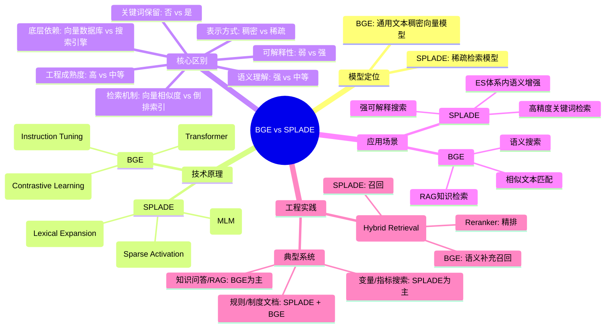

---
tags:
  - 稠密向量
  - 稀疏向量
  - RAG
description: 本文系统对比了BGE（稠密向量检索模型）与SPLADE（稀疏检索模型）。BGE基于Transformer和对比学习，生成语义向量，擅长深度语义理解，适用于RAG、语义搜索等场景。SPLADE基于MLM生成稀疏词权重，支持词汇扩展，具有强可解释性，适合高精度关键词检索及对现有搜索引擎的语义增强。二者核心区别在于表示方式、检索机制、可解释性及底层依赖。文章指出，在实际工程中（如银行风控系统），二者常通过混合检索方案结合使用，由SPLADE负责召回，BGE补充语义召回，再经重排序模型精排，以兼顾召回率、语义理解及可解释性。
source: https://chatgpt.com/c/6954c619-043c-8323-9f1c-769447c72872
---
## 一句话结论
BGE是侧重语义理解的稠密向量检索模型，SPLADE是侧重可解释关键词扩展的稀疏检索模型，二者并非二选一，在真实系统中常组合使用以实现更优的检索效果。
## 核心要点
- **模型定位**: BGE为通用文本稠密向量模型，用于语义检索；SPLADE为稀疏检索模型，基于深度模型进行关键词扩展。
- **核心技术**: BGE基于Transformer与对比学习，生成固定维度向量；SPLADE基于MLM生成稀疏词权重向量，具有词汇扩展能力。
- **核心区别**: BGE语义理解强、可解释性弱，依赖向量数据库；SPLADE可解释性强、语义理解中等，依赖倒排索引引擎。
- **应用场景**: BGE适合RAG、语义搜索、相似匹配；SPLADE适合高精度关键词检索、强可解释搜索及对现有ES体系升级。
- **工程实践**: 推荐混合检索方案，结合SPLADE（召回）、BGE（语义召回）和Reranker（精排）的优势。
## 关键概念
BGE（BAAI General Embedding）、SPLADE（Sparse Lexical And Expansion Model）、稠密向量（Dense Embedding）、稀疏向量（Sparse Vector）、对比学习（Contrastive Learning）、指令微调（Instruction Tuning）、倒排索引（Inverted Index）、词汇扩展（Lexical Expansion）、混合检索（Hybrid Retrieval）、Reranker（重排序模型）
## 脑图

## 适用场景
**BGE适用场景**: 需要深度语义理解的场景，如RAG知识库问答、非关键词驱动的自然语言语义搜索、文本相似度匹配（如客户画像、规则策略分析）。
**SPLADE适用场景**: 需要高精度命中关键术语或强可解释性的场景，如规则字段、变量名、指标口径检索，以及在现有Elasticsearch/Lucene体系上进行语义平滑升级。
**组合适用场景**: 在银行风控、合规、技术文档等复杂系统中，常采用混合检索架构，结合二者优势。
## 易混点 / 争议点
- **易混点**: 将BGE与SPLADE视为完全互斥的选择。实际上，它们在检索流程中常协同工作（如混合检索），而非替代关系。
- **争议/权衡点**: **语义理解深度 vs. 可解释性与控制力**。BGE在语义层面更强，但结果“黑盒”；SPLADE结果可解释，但对深层语义关系的捕捉可能不如BGE。工程选型需根据具体业务对准确性、可解释性、系统集成度的要求进行权衡。
## 我的理解
我的理解是，BGE和SPLADE代表了现代信息检索中“语义”与“词汇”两条技术路线的深度融合。BGE力图让机器越过字面匹配去理解意图，而SPLADE则是用深度学习赋能传统的关键词检索，使其更智能。在银行这类对准确性和可解释性都有高要求的领域，单一的模型往往难以满足所有需求。因此，文中强调的“混合检索”思路非常关键，它不是一个简单的技术堆砌，而是一种层次化的检索架构设计：先用SPLADE确保关键术语不被遗漏（高召回、可解释），再用BGE补充语义层面的相关结果，最后用重排序模型精细筛选。这种组合拳的方式，或许才是将大模型技术稳妥落地到生产系统的务实路径。

---
# 原文内容
下面从**模型定位、技术原理、差异对比和应用场景**四个层面，对 **BGE** 与 **SPLADE** 进行系统说明，并结合你在银行科技与风控系统建设中的实际背景，补充工程落地视角。

## 一、BGE 是什么
### 1. 模型定位
**BGE（BAAI General Embedding）** 是智源研究院（BAAI）推出的一系列 **通用文本向量表示模型**，典型代表如：
- bge-base-zh / bge-large-zh
- bge-m3（多语言 + 多任务）
- bge-reranker（重排序模型）

核心用途：
**将文本映射为稠密向量（dense embedding），用于语义相似度计算与向量检索。**

### 2. 技术原理
**（1）Dense Embedding**
- 基于 Transformer（BERT-like）
- 输入文本 → 输出固定维度向量（如 768 / 1024）
- 相似度通过 **向量距离（cosine / dot product）** 计算

**（2）对比学习（Contrastive Learning）**
- 使用正负样本对进行训练
- 目标：语义相近的文本在向量空间中更接近

**（3）指令微调（Instruction Tuning）**
- 明确区分 *query* / *passage*
- 提升在搜索与问答场景下的检索效果

### 3. BGE 的核心特点
- 语义理解能力强
- 对同义、近义、改写文本鲁棒
- 非常适合 **RAG / 语义搜索 / 向量数据库**

## 二、SPLADE 是什么
### 1. 模型定位
**SPLADE（Sparse Lexical And Expansion Model）** 是一种 **稀疏检索模型（Sparse Retrieval）**，定位在：
**用深度模型生成“可解释的稀疏词权重向量”，用于倒排索引检索。**

它本质上是：
- 语义增强版的 **BM25**
- 深度学习版的 **关键词检索**

### 2. 技术原理
**（1）Masked Language Model（MLM）**
- 基于 BERT MLM 结构
- 对输入文本预测整个词表中每个词的相关性

**（2）稀疏激活（Sparse Activation）**
- 输出向量维度 = 词表大小（如 30k+）
- 大部分词权重为 0，仅少量词被激活

**（3）词汇扩展（Lexical Expansion）**
- 不仅使用原文中的词
- 还能自动“补充”语义相关词（同义词、相关概念）

### 3. SPLADE 的核心特点
- 仍然基于 **倒排索引（Inverted Index）**
- 支持关键词命中 + 语义扩展
- **可解释性强**（能看到命中的词）

## 三、BGE vs SPLADE：核心区别对比
| 维度 | BGE | SPLADE |
| :--- | :--- | :--- |
| 表示方式 | 稠密向量（Dense） | 稀疏向量（Sparse） |
| 检索机制 | 向量相似度搜索 | 倒排索引搜索 |
| 底层依赖 | 向量数据库（FAISS / Milvus） | 搜索引擎（ES / Lucene） |
| 是否保留关键词 | ❌ 不显式保留 | ✅ 显式保留 |
| 语义理解 | 很强 | 中等（偏词级） |
| 可解释性 | 较弱 | 很强 |
| 对长文本适应 | 一般（需切分） | 较好 |
| 工程成熟度 | 高 | 中等 |

## 四、主要应用场景
### 1. BGE 的典型场景
**（1）RAG 知识检索**
- 内部制度、风控规则、产品文档问答
- “问法不固定，但能理解意思”

**（2）语义搜索**
- 非关键词驱动的搜索
- 适合业务人员自然语言查询

**（3）相似文本匹配**
- 客户画像相似度
- 规则、策略、需求相似度分析

👉 在银行场景中：
- 风控规则库语义检索
- 信贷政策 / 审批要点问答
- 技术文档与需求说明的相似度分析

### 2. SPLADE 的典型场景
**（1）高精度关键词检索**
- 必须命中关键术语（字段名、规则名、指标名）

**（2）强可解释搜索**
- 需要说明“为什么搜到这条”
- 合规、审计友好

**（3）ES 体系内语义增强**
- 在现有 Elasticsearch / Lucene 上平滑升级

👉 在银行场景中：
- 规则字段、变量名、指标口径检索
- 风控模型变量字典搜索
- 审计、内控、监管材料检索

## 五、工程实践中的组合方案（非常重要）
在真实系统中，**BGE 和 SPLADE 通常不是二选一，而是组合使用**：
### 1️⃣ Hybrid Retrieval（混合检索）
- SPLADE：召回（Recall）
- BGE：语义补充召回
- Reranker（如 bge-reranker）：精排
```
Query
 ├─ SPLADE（关键词 + 语义扩展）
 ├─ BGE（语义向量召回）
 └─ Reranker（精排 Top-K）
```

### 2️⃣ 适合你的典型系统
- **规则/制度类文档**：SPLADE + BGE
- **知识问答/RAG**：BGE 为主
- **变量/字段/指标搜索**：SPLADE 为主

## 六、一句话总结
- **BGE**：
👉 “让机器真正理解你在说什么”（语义优先）
- **SPLADE**：
👉 “在关键词体系里，用深度模型把词扩展开来”（可解释、可控）

如果你愿意，我可以**直接帮你设计一个“银行风控知识库”的 BGE + SPLADE 混合检索架构示意和选型建议**，包括 ES / 向量库 / reranker 的具体组合方式。

