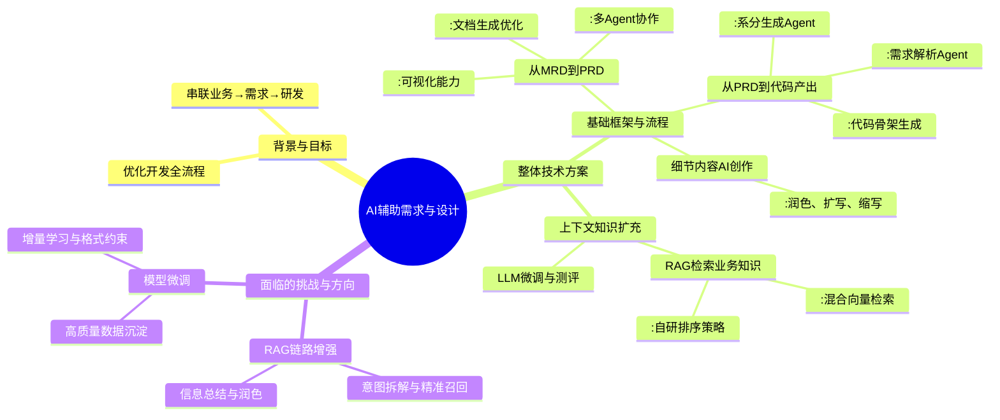

---
tags:
  - "AI辅助开发"
  - "需求分析"
  - "大模型应用"
description: "本文介绍了利用大模型和多智能体（Agent）协作，构建从市场需求（MRD）到产品需求文档（PRD）、再到系统分析与代码生成的AI辅助全链路开发流程。文章详细阐述了整体技术方案，包括通过多Agent协作自动化生成和优化PRD、利用问答和系分Agent解析需求并产出代码骨架，以及结合RAG（检索增强生成）技术增强业务上下文理解。同时指出了当前面临的挑战，如RAG召回的精准性和高质量微调数据的不足，并提出了相应的优化方向。该实践旨在显著提升产品研发的效率、规范性和质量。"
source: "https://mp.weixin.qq.com/s/TjSdQzdJXX-MbhHccvbh3g"
---
## 一句话结论
利用大模型和多智能体协作构建的AI辅助开发流程，可以实现从业务需求到系统分析与代码生成的全链路智能化，显著提升研发效率和质量。
## 核心要点
- **整体目标**：利用AI智能体串联“业务诉求→需求→研发”全链路，提升效率。
- **核心流程**：
  - 从MRD到PRD：通过多Agent协作生成、优化和输出高质量产品需求文档。
  - 从PRD到代码：通过问答、系分生成、优化等Agent，将需求解析并自动生成系统分析文档及代码骨架。
- **关键技术**：结合RAG（混合稠密与稀疏向量检索）增强上下文理解，以及模型微调、文档测评等手段优化生成质量。
- **细节优化**：提供AI创作能力（如润色、扩写、缩写）辅助文档细节处理。
- **挑战与方向**：需增强RAG意图匹配与召回质量，并通过高质量数据沉淀与模型微调持续改进。
## 关键概念
PRD（产品需求文档）、MRD（市场需求文档）、RAG（检索增强生成）、Agent（智能体）、稠密向量（BGE）、稀疏向量（SPLADE）、LoRA微调、系统分析（系分）、代码骨架
## 脑图

## 适用场景
企业产品研发团队，尤其是需要快速、规范地处理产品需求、进行系统分析并生成基础代码的软件开发和项目管理场景。
## 易混点 / 争议点
- **易混点**：RAG中的稠密向量检索（如BGE）与稀疏向量检索（如SPLADE）的区别及如何结合使用。
- **争议点**：AI生成的PRD和系统分析文档的质量与准确性是否足以替代人工深度设计和评审；在复杂业务场景下，模型微调所需高质量数据的获取与标注成本。
## 我的理解
本文提出了一套利用大模型自动化产品开发前期工作的系统方案。其核心是模块化、智能体化的流程设计，将需求处理拆解为多个专业Agent协作的任务，并引入RAG技术增强业务理解。这不仅是工具效率的提升，更是一种研发流程的重构。
> [!abstract] **当前挑战集中在如何让AI更精准地理解复杂、模糊的业务意图，这需要算法、数据和工程能力的持续结合** #Aicoding

---
# 原文内容

# 大模型在需求分析与设计中的提效实践

原创 舒阳 阿里云开发者 2025年12月31日 08:31 浙江

## 一、背景介绍

随着 AI 技术的快速发展，越来越多的企业开始积极探索如何利用 AI 优化产品开发流程。从初期的产品需求文档（PRD）撰写、系统分析与设计，到高质量代码的生成，AI 正逐步渗透到开发全流程，构建起一个完整的“AI辅助开发生态”，显著缩短开发周期。在传统开发流程中，PRD 和系统分析文档的设计以及编码实现需要人工拆解、设计和开发，这不仅易产生理解偏差和重复工作，还存在效率低下、质量不稳定、协作复杂等痛点。而 AI 技术可以自动完成模块拆分、数据结构定义、接口设计等关键环节，同时生成适配多语言、多框架的代码骨架，大幅降低沟通成本，提升开发效率和产出质量。

## 二、整体目标

为全面提升产品研发效率，我们的整体目标是让 AI 智能体覆盖产品研发全流程，实现从业务诉求→需求 → 研发 的端到端全链路环节智能化串联，通过不同环节的智能化建设，大幅助力团队效率提升。

## 三、整体技术方案

### 1. 基础框架与流程
![[d2e28bb153e79a9434155c04bff92e70.png]]

业务诉求→需求 → 研发整体架构

该图展示了需求从输入到智能化处理全过程，分为三部分：RAG分析阶段从用户输入中检索和整合相关信息；PRD生成阶段通过多Agent协作完成文档生成、迭代优化和方案输出；系统分析阶段对功能模块进行分析验证，并形成闭环处理，最终输出高质量的数据或文档结果。整个流程提升了需求处理的效率与规范性。

### 1.1 从MRD到PRD文档的落地

MRD到PRD文档 流程设计细节图

本流程图展示了PRD（产品需求文档）生成智能体的整体运行机制，通过大模型实现高效、规范和自动化的文档编写与需求处理。整个流程覆盖了从需求输入、分析、生成、优化到文档编辑的完整生命周期，帮助产品团队快速生成高质量的PRD，减少人工干预。

- **用户输入阶段：**
  - 自然语言输入：支持用户通过语言描述需求。
  - 文件上传：用户可上传相关资料（如MRD、业务流程文档、图片等），增强需求提供的上下文信息。

- **需求大纲分析阶段：**
  - 默认模板：智能体依据标准模板结构，分析需求背景、目标价值和功能模块，使输出文档逻辑更清晰，结构更规范。
  - 目标价值Agent：明确需求的核心目标，确保业务价值传达清晰。
  - 需求价值Agent：评估每个需求的优先级和重要程度，为生成过程提供参考依据。
  - 业务流程图Agent：自动生成功能逻辑和模块关系的可视化流程图，简化复杂需求的理解。

- **需求智能生成阶段：**
  - 多Agent协作：
    - 目标价值Agent：对具体需求目标进行进一步细化和完善。
    - 绘图Agent：生成更细致的流程图和功能模块关系图，增强需求表达的直观性。
    - 方案设计Agent：智能生成技术解决方案，例如接口设计、架构逻辑等。

- **需求总结与优化阶段：**
  - 需求总结与优化：对系统生成的文档和方案进行整合，构建文档的完整性和统一性。用户可根据反馈对PRD内容进行优化调整，系统支持多轮迭代润色，确保文档的逻辑性和内容完备。

- **文档编辑与最终输出阶段：**
  - 在线编辑：用户可借助系统提供的编辑工具对文档进行微调、完善和最终校对，确保个性化需求得以实现。
  - 输出目标：以标准化格式完成PRD终稿，为开发团队提供明确可操作的需求指导。

**可视化能力：**
能够直观呈现复杂功能模块和流程逻辑图，辅助团队更好地理解需求和设计。

**多轮优化保证质量：**
结合用户参与和智能体优化，支持多次迭代调整，确保生成的最终文档符合业务目标且具有高质量。

### 1.2 从PRD到系分再到代码产出

系统架构

需求 → 研发 流程设计

本流程图展示了一套从 PRD（产品需求文档）生成到代码实现的智能化开发流程框架，实现了产品研发过程中从文档到代码生成的一体化闭环。通过智能体对 PRD 的深度解析和逐步拆解，从需求定义到模块生成，再到代码输出。使得系统分析到代码实现的过程更加高效、规范。

用户（研发人员）将 PRD 文档 输入到系分生成智能体中，作为整个流程的起点。PRD 文档中包括产品需求的完整描述，智能体将基于这些输入开始后续的系统生成工作。

- **问答Agent：**
  - 自然语言识别：解析 PRD 的自然语言内容，提取关键信息。
  - 附件内容识别：读取并理解文档附加的内容。

- **系分生成Agent：**对需求内容进行深入分析和结构化处理：
  - 提取需求背景、整体需求和数据层需求。
  - 标注项目的重点关注点，通过前期任务拆解和分析，明确可执行模块（如接口、数据表、数据流程等）。
  - 对功能模块进行前期分析，生成初步的设计思想与逻辑。

- **总结Agent：**
综合处理所有收集到的内容后生成：
  - 内容总结：对提取出的关键信息进行整合，形成结构化的文本内容。
  - 内容排版：输出清晰且具有规范化格式的系分文档初稿，提供后续使用基础。

- **内容优化Agent：**
进一步处理并细化生成文档：
  - 文档指引：增强文档的可读性和结构逻辑，提升系统分析文档的表达效果。
  - 绘图角色：自动生成图表（如数据流图、系统结构图等）的角色信息，直观展示文档相关的结构和逻辑。
  - 表格描述与扩展：优化生成的表格内容，并在需求上下文的基础上补全细节。

- **生成代码骨架：**
  - 在 IDE 中自动生成后端项目的基础代码骨架，例如常见的控制层、业务层、数据访问层以及实体、传输对象等结构。

### 1.3 细节内容AI创作

**AI创作：**
- 自定义对话：更加用户输入调整文本
- 润色：润色语句，文本
- 扩写：对原文本进行补充
- 缩写：概括原文本内容

### 2. 上下文知识扩充升级，增强业务理解能力

业务→需求 RAG检索业务知识和测评

此外，流程扩充了两个关键支撑模块：

- **RAG检索业务知识：**
  - 通过检索产品领域的历史 PRD、产品介绍、知识百科等语义相关文档，扩展输入内容的上下文，增强生成文档的完整性与准确性。

- **LLM 微调与文档测评：**
  - LLM 微调：包括数据合成、LoRA 微调等，针对特定需求场景优化大语言模型生成能力。
  - 文档测评：结合人工测评与模型自动化测评（综合主观与客观反馈），对 PRD 的准确性、规范性及高质量输出进行评估，确保最终文档满足业务需求。

### 2.1 RAG辅助智能体过程

- **用户数据选择与初始化：**
  - 根据用户传入的信息确定对应的知识库数据集，或者由用户手动选择数据集。
- **数据集确认与初始化处理：**
  - 系统会根据用户选择或自动匹配合适的知识库，作为检索和生成的上下文来源。

- **调用RAG接口：**
  - 通过 RAG 接口处理数据，检查数据集是否为空：
    - 如果为空：将整个模型知识下的所有文档作为数据源。
    - 如果非空：以数据集中的特定文档作为数据源。
- **文档数据与输入信息处理：**
  - 根据用户输入信息提取相关文档，同时结合两种向量化方案：
    - 稠密向量（BGE）：用于稠密向量的检索和排序。
    - 稀疏向量（SPLADE）：用于稀疏向量的检索和排序。

在检索层，我们同时结合了稠密向量与稀疏向量检索（例如基于 BGE、SPLADE 等模型），并通过自研排序策略综合打分，选出与当前需求最相关的文档片段。

- **综合排序：**
  - 对稠密向量和稀疏向量的检索结果进行综合打分排序。
- **自研排序策略排序与结果输出：**
  - 通过自研排序策略综合打分，根据用户需求筛选出相关性最强的文档块，进行输出和呈现。

整个流程以确保为用户查询提供准确、优化的文档检索结果为目标，同时支持多种处理逻辑和灵活的数据集选择方式。

## 四、面临的挑战以及后续可以研究的方向

尽管 MRD 到系统分析（系分）的流程已经实现了智能化和自动化，但仍然在某些环节面临需要优化和增强的挑战，这些挑战主要体现在如下几个方面：

### 1、RAG链路增强

**当前挑战**：确保信息召回的准确性与用户意图的匹配。

**解决方案**：RAG链路增强
- 在 RAG 召回链路中，为确保信息召回的准确性与用户意图的匹配，需要在调用 RAG 接口之前配置模型，旨在对用户意图进行拆解，并基于拆解出的问题执行历史数据的精准召回。同时，在完成 RAG 信息召回后，需进一步配置模型对所召回的信息结合历史对话信息进行总结与提炼，通过归纳与润色提升内容质量和表达效果，为后续流程提供更高质量prd内容的支持。

### 2、 模型微调

- 当前仍然面临高质量领域数据沉淀不足的挑战；
- 在复杂业务场景下，仍需通过多轮优化与灰度实践持续提升生成质量；
- 接下来会重点在增量学习与格式约束数据采集上持续投入；
- 未来将在真实业务场景中引入更多标注数据，持续迭代模型能力。

