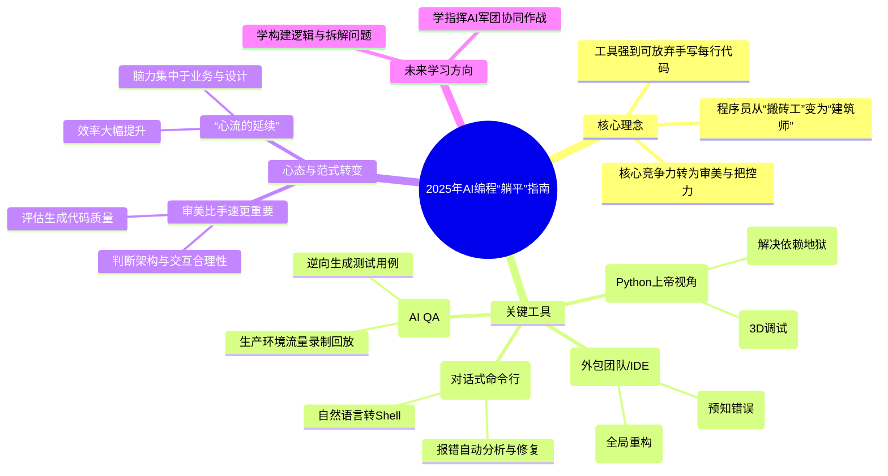

---
tags:
  - "AI编程"
  - "开发者工具"
  - "编程范式"
description: "本文是一篇关于2025年AI编程工具发展与开发者角色转变的年度总结。作者回顾了AI工具从2023年像“实习生”一样需要精细引导，发展到2025年成为具备全局视野、主动协作能力的“Tech Lead”。文章重点介绍了四款核心工具：**Cursor**（具备全局重构和预运行错误检测的IDE）、**Antigravity**（提供可视化调试和智能环境管理的Python IDE）、**Kiro**（将自然语言转换为Shell命令的对话式命令行工具）以及**Trace**（自动生成测试用例并支持生产流量回放的AI测试工具）。作者指出，这些工具将程序员从低价值的重复劳动中解放出来，实现了“心流的延续”，使脑力能够集中于业务逻辑和系统设计。同时，程序员的核心价值发生了转变：从代码编写者升级为系统架构师和AI指挥官，核心竞争力在于对生成代码的“鉴赏力”和对系统设计的“把控力”。文章结论是，在AI时代，学习编程的重点不再是语法，而是问题拆解、逻辑构建以及与AI协同作战的能力。"
source: "https://juejin.cn/post/7588934987510267931"
---
## 一句话结论
AI编程工具在2025年已从辅助工具演变为核心生产力，使程序员角色从代码编写者转变为系统架构师和AI指挥官。
## 核心要点
- **AI工具演变**：AI从简单的代码生成工具（如早期ChatGPT）发展为具备全局视野、主动协作能力的综合开发环境（如Cursor、Antigravity）。
- **核心工具**：
  - **Cursor**：作为“外包团队”，提供全局代码重构、预运行的Shadow Workspace，防止错误。
  - **Antigravity**：为Python开发者提供可视化调试、智能依赖管理，提升开发体验。
  - **Kiro**：将命令行转换为自然语言对话界面，自动生成并修复Shell命令。
  - **Trace**：自动生成全面测试用例，并利用生产环境流量进行本地回放测试。
- **范式转变**：程序员价值从编写代码转向问题拆解、系统设计、审美把控和AI指挥。
- **核心能力**：对生成代码的鉴赏力、对系统设计的把控力以及维持高效“心流”的能力成为关键。
## 关键概念
- **Cursor**: 一款AI驱动的代码编辑器/IDE，具备Composer（撰写者）模式和Shadow Workspace（影子工作区）功能。
- **Antigravity**: 一款面向Python开发者的AI增强IDE，提供代码执行可视化流和自动环境管理。
- **Kiro**: 一款AI命令行工具，可将自然语言指令转换为并执行Shell命令，具备上下文记忆和错误自动修复能力。
- **Trace**: 一款AI测试工具，能逆向生成测试用例并进行生产环境流量录制回放。
- **心流 (Flow)**: 指程序员能专注于核心业务逻辑而不被琐事打断的高效状态。
- **鉴赏力与把控力**: 在AI生成代码时代，程序员评估代码质量、设计合理性和架构适用性的核心能力。
## 脑图

## 适用场景
- **软件开发全流程**：适用于从后端CRUD接口生成、前端页面修改到API文档更新的完整开发任务。
- **Python项目开发与维护**：特别适合处理复杂依赖、调试数据流和接手遗留Python项目。
- **系统运维与操作**：适用于需要通过命令行执行的复杂文件操作、服务部署和故障排查场景。
- **软件测试**：适用于单元测试、集成测试的自动化生成，以及利用真实数据在本地重现生产环境问题。
- **程序员效率提升**：适合希望将精力从样板代码和琐碎操作中解放出来，专注于高价值设计工作的开发者。
## 易混点 / 争议点
- **易混点**：
  - **AI工具 vs. 传统工具**：本文强调的Cursor、Antigravity等并非简单的智能提示插件，而是具备主动规划、全局理解和预执行能力的新一代IDE。
  - **“躺平” vs. “失业”**：文中的“躺平”指借助工具从重复劳动中解放，并非不工作，而是角色升级（建筑师 vs. 搬砖工），这与“程序员被AI取代”的悲观论调相反。
- **争议点**：
  - **测试的自动化边界**：Trace主张“人不应写单元测试”，这可能会引发关于测试用例创造性、边界条件人为定义重要性的争议。
  - **工具依赖与技能退化**：过度依赖AI工具可能导致程序员对底层原理、语法细节的生疏，在工具失效或需要深度优化时面临挑战。
  - **“品味”的可量化与普适性**：文中将“审美”、“品味”作为核心竞争力，但这具有一定主观性，且不同领域、不同规模的项目对“好代码”的定义可能存在差异。
## 我的理解
作者的核心洞察在于，当AI能高效处理具体实现（代码生成、环境配置、命令执行、测试编写）时，程序员的核心价值发生了位移：从**执行者**转变为**定义者、评审者和协调者**。我们需要定义问题、拆解需求（指挥AI），并对AI的产出进行质量评审和架构把关（鉴赏与把控）。这实际上提高了对程序员综合能力的要求，而非导致失业。所谓的“躺平”，是摆脱低价值重复劳动，从而能够更持续地进入高价值创造的“心流”状态。未来，学习编程的重点将不再是语法记忆，而是计算思维、系统设计能力和与AI协作的方法论。

---
# 原文内容
当AI不再是“玩具”，我们是如何用Trace、Antigravity和Cursor“躺平”？

### 从“哇塞”到“真香”的质变

回想两年前，2023年那会，我们刚接触ChatGPT和Copilot的时候，每天都在惊呼：“卧槽，这玩意儿能写快排！”那时候的AI像个刚毕业的天才实习生，聪明但经常胡说八道。

一转眼到了2025年底。现在的感觉变了。AI不再是那个需要你哄着写Prompt的实习生，它更像是一个不知疲倦的**Tech Lead**。

今年是我彻底放弃“手写每一行代码”执念的一年。不是我懒，而是工具太强了。如果你现在还在用纯Vim或者没有任何插件的VS Code硬刚业务逻辑，说实话，你正在这辆飞速行驶的技术列车上表演“徒手扒火车”。

今天这篇长文，不讲虚头巴脑的概念，咱就聊聊这一年陪我熬夜、帮我背锅、让我早点下班的那些神级工具：**Cursor, Antigravity, Kiro, Trace** 等等。

### Cursor：它已经不是编辑器了，它是我的外包团队

如果说2024年的Cursor还是VS Code的魔改版，那2025年的Cursor简直就是**IDE界的“钢铁侠战衣”**。

#### 1. Composer 模式的完全体

以前我们用AI，是一问一答：“帮我写个函数”。
现在的Cursor Composer（撰写者模式）是：“帮我把这个User模块重构一下，数据库字段加一个last_login，顺便把前端的Profile页面也改了，API文档也更新一下。”

它不再是盯着光标处的那一行代码，它有了**全局视野**。今年我在做那个SaaS项目时，最爽的一次体验是，我直接丢给它一张数据库ER图的截图，然后说：“按这个结构生成后端CRUD接口，用FastAPI。”

两分钟后，Model、Schema、Router全出来了。我只需要像个甲方一样指指点点：“这儿没做鉴权，那儿少个分页。”

#### 2. Shadow Workspace（影子工作区）

这是Cursor今年最大的杀手锏。以前改代码怕改挂了，得切个分支。现在Cursor在你打字的时候，已经在后台的“影子空间”里预运行了你的代码。

当你还在犹豫变量名起什么的时候，它已经在右下角提示你：“老兄，你这样写待会儿跑不通的，因为第50行的那个依赖包版本不兼容。” 这种**预知未来**的能力，真的救了我无数次生产环境的P0级事故。

### Antigravity：Python开发者的上帝视角

如果你是Python开发者，今年没用过 **Antigravity**，那你真的错过了太多。它的名字取自那个经典的XKCD漫画（Python能让你飞起来），但2025年的这个工具，是真的让你**无视重力**。

#### 1. 也是IDE，但是是3D的？

Antigravity 不再是冷冰冰的代码行。它引入了“可视化堆栈”的概念。以前调试代码，我们是打断点，一步步Next。在Antigravity里，代码的执行流被画成了一张动态的图。

你可以清晰地看到数据流怎么从API进来，经过了哪些中间件，在哪里被堵塞了。

#### 2. 依赖地狱的终结者

Python的包管理一直是噩梦。pip、poetry、conda 混在一起能要把人逼疯。Antigravity 内置了一个AI环境管家。

我有一次接手一个祖传的Django项目，依赖乱得像盘丝洞。我直接把项目拖进 Antigravity，点了一下“Fix Environment”。它自动扫描了所有import，分析了版本冲突，然后给我生成了一个完美的虚拟环境。它甚至悄悄把几个有安全漏洞的包给升级并适配了。

**心得：** Antigravity 让我感觉自己不是在写代码，而是在像修理钟表一样，精准地调整每一个齿轮的咬合。

### Kiro：终结了“查文档”时代的命令行

记得以前要在终端里搞点复杂的运维操作，比如“查找所有大于100M的文件并按修改时间排序后删除”，我得去Google一下 find 命令的参数，或者去翻 man 手册。

**Kiro** 的出现，把Terminal变成了聊天窗口。

#### 1. 自然语言转Shell

现在我的终端日常是这样的：

> 我：kiro 帮我把当前目录下所有的png图片压缩50%然后移动到 dist 文件夹
> Kiro: Running: find . -name \\"*.png\\" -exec convert {} -quality 50% dist/{} \\; （自动执行）

它不是简单的翻译，它懂上下文。如果你连续操作，它记得你上一步进了哪个目录，记得你刚才部署的是哪个服务。

#### 2. 报错自动修

最神的是，当命令报错时，Kiro不会只给你扔一堆红色的Error Log。它会直接分析报错原因：
“报错是因为端口8080被占用了，占用者是PID 1234 (Java)。你要杀掉它吗？”
我只需要回一个 y。

这种丝滑感，让我这个老运维都感动得想哭。Kiro 让 CLI（命令行界面）变成了 CUI（对话式界面）。

### Trace：那个不用你写测试用例的QA

**Trace** 是今年测试领域的黑马。它的理念非常激进：**“人是不应该写单元测试的”**。

听起来很狂对吧？但它做到了。

#### 1. 逆向生成测试

Trace 挂在你的后台，它会观察你平时的手动测试行为，也会分析你的业务逻辑代码。当你写完一个 OrderService 类，保存的那一瞬间，Trace 已经在后台生成了覆盖率100%的测试用例。

它不仅仅是生成 assert 1==1 这种废话，它会生成边界条件测试。比如你写了个除法，它自动生成除以0的Case；你写了个金额计算，它自动生成负数输入的Case。

#### 2. 生产环境录制回放

Trace 最强的功能是**Traffic Replay**。它能对生产环境的流量进行脱敏录制，然后在我本地开发环境里回放。

这意味着，我本地调试的不是假数据，而是真实用户产生的数据（当然是脱敏的）。这解决了困扰程序员几十年的千古难题：“**在我本地明明是好的啊！**”

### 2025年的编程范式：我们还是程序员吗？

聊完工具，我想聊聊心态。

今年我也听到很多声音，说程序员要失业了。但我这一年用下来，感觉恰恰相反。**我们没有失业，但我们转行了。**

我们从“搬砖工”（Bricklayer）变成了“建筑师”（Architect）。

#### 1. 这种感觉叫“心流的延续”

以前写代码，很容易被打断：查语法、修标点、配环境。
现在有了 Cursor + Antigravity + Kiro，这些琐事都被AI接管了。我可以把所有的脑力都集中在**业务逻辑**和**系统设计**上。

以前做一个功能要3天，其中2.5天在写Boilerplate（样板代码）。现在做一个功能只要半天，剩下2.5天我可以去优化性能、去思考用户体验、甚至去陪女朋友（划掉，去学习新框架）。

#### 2. 审美变得比手速更重要

当AI能帮你生成一切的时候，**品味**就成了核心竞争力。

*   你知道这段生成的代码虽然能跑，但结构很烂吗？
*   你知道这个UI虽然画出来了，但交互反人类吗？
*   你知道这个架构虽然流行，但不适合现在的业务规模吗？

工具越强，越需要一个有经验的人去按住AI的手说：“停，这里不能这么写，会由于并发问题导致死锁。”

这就是2025年资深程序员的价值——**鉴赏力与把控力**。

### 结语

2025年，是编程技术彻底爆发的一年。编程不再是Ctrl+C、Ctrl+V😂，它变成了一种更亲民、更高效的创造方式。

如果你问我，现在还要不要学编程？
我的回答是：**要学。但不要学怎么写语法，要学怎么构建逻辑，怎么拆解问题，怎么指挥AI军团为你作战。**

如果你还没有试过 Cursor 的 Composer，没在 Antigravity 里飞过，没跟 Kiro 聊过天，哪怕只是为了好玩，也可以尝试一下。

毕竟，**偷懒，才是人类科技进步的第一生产力。**

*(最后插一句，这篇文章的大纲是 Cursor 帮我理的，配图建议是 Gemini 提的，但我保证，这段感慨是我自己一个个字敲出来的。)*

**希望这篇年度总结能给你带来一些共鸣。明年见！**

