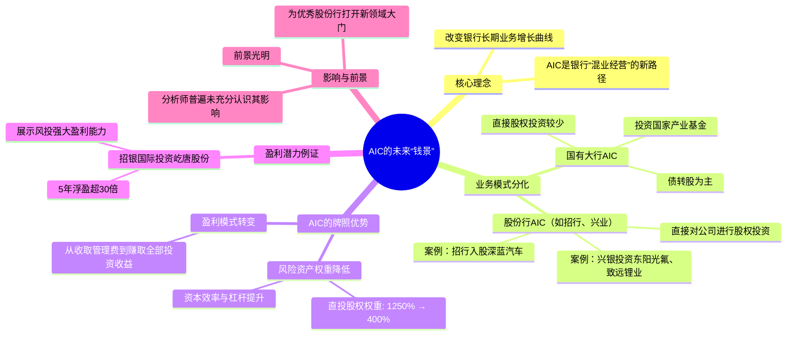

---
tags:
  - AIC
  - 股权投资
description: 本文探讨了AIC（金融资产投资公司）对商业银行未来发展的战略意义。文章指出，AIC的业务模式已分化为两种：国有大行侧重国家产业基金与债转股，而股份行（如招行、兴业）则积极进行直接股权投资。AIC牌照的关键优势在于将股权投资的风险资产权重从1250%大幅降至400%，显著提升了银行的资本效率与投资杠杆。作者以招银国际投资屹唐股份获利超30倍为例，证明了该业务的巨大盈利潜力。文章最终结论认为，AIC实质上是为部分银行打开了“混业经营”的新大门，将重塑其业务增长曲线，前景广阔。
source: https://mp.weixin.qq.com/s/ZaSZsficdqjglAij6M7CLg
---
## 一句话结论
AIC牌照为部分商业银行开辟了混业经营的新路径，通过改变风险资产权重显著提升其股权投资能力与盈利潜力，前景广阔。
## 核心要点
1.  AIC（金融资产投资公司）的业务模式分化为两条路线：国有大行主要投资国家产业基金及债转股；股份行（如招行、兴业）则直接进行公司股权风投。
2.  AIC牌照将普通工商企业股权投资的风险资产权重从1250%降至400%，大幅提高了银行直投的资本效率与杠杆能力。
3.  银行通过AIC开展股权投资盈利潜力巨大，文中以招银国际投资屹唐股份为例，5年浮盈超30倍。
4.  AIC被视为对部分银行实质性的“混业经营”开放，将改变其长期业务增长曲线，尤其对商业嗅觉敏锐的股份行构成重大利好。
## 关键概念
AIC（金融资产投资公司）、混业经营、风险加权资产、债转股、股权投资、风投、招银国际、兴银AIC、风险资产权重（1250% vs 400%）
## 脑图

## 适用场景
适用于分析中国商业银行，特别是已设立或可能设立AIC的股份制银行和国有大行的未来业务转型、盈利增长点及投资价值评估。也适用于关注金融监管政策（如风险资产权重调整）对银行业务结构影响的领域。
## 易混点 / 争议点
1.  **易混点**：AIC的前身主要用于债转股，容易让人误以为其现今业务仍局限于债转股或“明股实债”，而忽视了其开展市场化股权投资的能力。
2.  **争议点**：银行是否具备成功的股权投资基因。传统观点认为银行擅长债权而非股权，但作者以股份行AIC的实际案例反驳此观点，认为部分银行（如招行、兴业）通过长期布局已具备相应能力。
## 我的理解
本文的核心在于揭示AIC（金融资产投资公司）牌照对商业银行的战略价值。它并非简单的业务扩充，而是通过监管规则（风险资产权重从1250%大幅降至400%）的关键调整，实质上为银行，尤其是市场化程度高的股份行，打开了参与高收益股权投资的大门。这改变了银行传统上依赖存贷利差的盈利模式，是向“混业经营”迈出的实质性一步。文中用招银国际的成功投资案例（如屹唐股份）具象化地展示了这种新业务的巨大盈利潜力，从而论证了其光明的“钱景”。

---
# 原文内容
前不久我在专栏里刚刚点评过招行入股深蓝汽车风投的项目。当时，有粉丝在文章下留言说“你可以放心，银行做风投，做不好”，“估计是明股实债”。对此，我只能说很多投资者甚至一些银行员工对于AIC的认知还很不到位。

当然，这也不能怪这些朋友。因为，AIC的前身确实是用来搞债转股的。而且，2024年先期试水的6大国有行的AIC在业务拓展上确实比较保守。国有大行AIC成立一年，你鲜有听闻它们有什么风投的大动作。估计多数还是跟随国家产业基金去孵化一些高科技企业。这就造成了大家一种错觉“银行不会搞风投，银行没有股权投资的基因”。

但是，随着三家股份行AIC的开业，让大家闻到了一丝不一样的味道。前面招行高调入股深蓝汽车原始股，这里我就不展开了。再放两条兴银AIC的新闻：

广东东阳光科技控股股份有限公司（证券代码：600673，下称\\"东阳光\\"）今日发布公告称，公司控股子公司乳源东阳光氟有限公司（下称\\"东阳光氟\\"）拟通过增资扩股方式引入战略投资者兴银金融资产投资有限公司（下称\\"兴银投资\\"），后者将以7亿元现金全额认购东阳光氟新增注册资本，交易完成后东阳光仍保持对标的公司的绝对控制权。

盛新锂能集团股份有限公司（证券代码：002240，下称\\"公司\\"）12月19日发布公告称，其全资子公司四川致远锂业有限公司（下称\\"致远锂业\\"）将通过增资扩股方式引入兴银金融资产投资有限公司（下称\\"兴银投资\\"）作为战略投资者。兴银投资将以现金5亿元认购致远锂业25%股权，本次交易完成后，致远锂业仍为盛新锂能控股子公司。

通过招银AIC和兴银AIC的项目披露，基本都是和上市公司开展股权投资合作，包括但不限于：未上市股权投资，上市公司子公司定增等。这是正经风投该干的活儿。虽然，AIC不会像券商那样可以从二级市场上购买股票搞自营盘。但是，AIC对于未上市公司的股权投资还是有很大自由度的。

由此可见AIC的运作模式基本上形成了2条路线：以国有大行为代表的AIC主要投资和参股国家平台的产业基金，以及债转股，直接操盘特定公司股权投资的案子较少；以股份行为代表的AIC主要直接对公司股权进行风投。

两类银行之所以选择不同的路线和两类银行自身的禀赋不同有关。国有大行长期运作化债相关工作，债转股占比较高，再加上背负了产业升级等国家任务，所以其投向较少定位到单个公司的权益投资。股份行从成立迄今一直是走商业路线为主，其中招行和兴业银行更是很早之前就将投商一体化作为发展方向，所以这两家的AIC主要以选定企业的股权投资为主。当然，两者还有细微的差别。由于招行10年前就开始布局招银国际，所以招银AIC可以依托招银国际做很多IPO，这一点是兴银AIC不具备的。

AIC这个新业务具有强大的盈利能力，当然风险也远高于银行传统的信贷业务。为了让大家更直观地了解AIC的盈利能力。我这里引用一个招银国际投资的案例。招银国际成功的案例很多名声最大的就是宁德时代，大家都知道招银国际投资宁德时代赚了大钱，但是具体赚了多少外界没有详细的数据。我现在举的这个例子有更详细细节。这个例子源自上市公司屹唐股份（688729.SH）IPO的招股意向书。

根据屹唐股份2025年6月18日发布的招股意向书47-48页披露其上市前的股权转让明细，如下图1所示：

图1

从图1我们可以看出，屹唐股份在2020年7月曾经将约5%（4.05%+0.94%=4.99%）的股权转让给招银国际相关的股权私募。转让价格为1.34元/注册资本。定价依据是截止2019年9月30日的净资产评估价21.29亿元。据此估算，招银国际相关的股权私募获取这些股权的投入约1.06亿。

屹唐股份IPO发行新股后公开发行股份占总股本的10%。也就是说招银国际相关的股权私募占有IPO后4.49%的股份。根据2025年12月27日收盘后的股价计算，4.49%的屹唐股份市值≈744.8*4.49%=33.63亿。所以，仅屹唐股份的这笔投资，招银国际的相关私募浮盈超过30倍。5年的时间浮盈超过30倍，这就是风投业务强大的盈利能力。

在没有AIC牌照之前，招银国际是通过资管资源池对接这些风投资产，背后是私人银行的理财产品。招银国际不直投的重要原因就是普通工商企业股权资产要按照1250%的权重系数计入风险加权资产。直投占用资本金太高。有了AIC牌照后，普通工商企业股权资产要按照400%的权重系数计入风险加权资产，这就相当于把股权投资的杠杆倍数拉高了2倍。原来不能自己做的项目可以自己做了，原来利润大头留给客户自己只能收浮动管理费或业绩提成的，现在可以全部自己赚了。

个人认为目前多数分析师并没有认识到AIC牌照对未来银行业务产生的影响。我认为，AIC相当于对部分大中型银行实质性开放了“混业经营”，这将改变部分银行的长期业务增长曲线。这一变化为部分商业嗅觉比较敏感的优秀股份行打开了一扇通往新领域的门，跨过去钱景一片光明。

