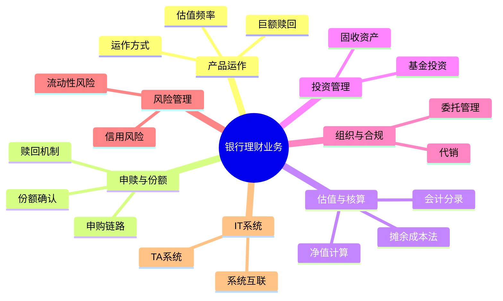

# 银行理财业务知识体系总结

---

## 1. 理财产品运作与产品形态

**核心概念 / 痛点**：  
解决“理财产品如何运作、为什么要这样设计”的问题，是理解申赎、估值、系统实现的前提。

---

### 1.1 理财产品的运作方式

**原始问题场景**：

- 理财产品的运作方式有什么区别？
    
- 运作方式有什么意义？
    

**专家解答摘要**：

- 运作方式通常包括：
    
    - 开放式 / 封闭式 / 定期开放
        
    - 净值型 / 类货币型
        
- 运作方式决定：
    
    - 是否允许随时申赎
        
    - 申赎确认节奏（T+0 / T+1）
        
    - 流动性管理和资产配置方式
        
- 本质是**在流动性、收益稳定性、投资复杂度之间做权衡**。
    

💡 **专家提示**：

> 运作方式不是营销概念，而是产品风险、系统复杂度和资产结构的“总开关”。

---

### 1.2 运作方式与估值频率 / T+1 机制

**原始问题场景**：

- 为什么大多数理财是 T+1？
    
- 运作方式和估值频率有什么关系？
    

**专家解答摘要**：

- 估值频率取决于：
    
    - 底层资产的可估值性（债券 vs 非标）
        
    - 市场价格获取的及时性
        
- T+1 的核心目的：
    
    - 防止利用未确认净值进行套利
        
    - 保证净值的准确性与可审计性
        

💡 **专家提示**：

> T+1 不是“技术落后”，而是风险控制和公平性设计的结果。

---

### 1.3 运作方式与巨额赎回规则（系统视角）

**原始问题场景**：

- 巨额赎回怎么处理？
    
- 系统上怎么实现？
    

**专家解答摘要**：

- 巨额赎回通常触发：
    
    - 比例确认（如按当日赎回比例确认）
        
    - 延期支付或顺延处理
        
- 系统侧需要：
    
    - 赎回比例计算
        
    - 份额拆分与状态管理
        
    - 多日赎回队列控制
        

💡 **专家提示**：

> 巨额赎回本质是“流动性压力事件”，不是简单的交易异常。

---

### 1.4 运作方式在监管检查中的常见问题

**原始问题场景**：

- 监管一般查哪些点？
    

**专家解答摘要**：

- 常见检查关注：
    
    - 运作方式是否与合同一致
        
    - 是否存在变相保本、刚兑
        
    - 估值与申赎是否存在利益输送
        
- 系统需支持：
    
    - 全流程留痕
        
    - 状态可回溯
        

💡 **专家提示**：

> 监管看的是“是否可解释”，而不是“是否从未出问题”。

---

## 2. 申购、赎回与份额机制

**核心概念 / 痛点**：  
解决“客户钱如何变成份额，又如何变回钱”的问题，是理财运作的核心。

---

### 2.1 一次理财申购的系统交易链路

**原始问题场景**：

- 一次理财申购涉及哪些系统？
    

**专家解答摘要**：

- 典型链路：
    
    - 客户前端 → TA → 托管行（资金）
        
    - TA → 会计系统（分录）
        
    - TA → 估值系统（份额基数）
        
    - TA → 风控系统（集中度、流动性）
        

💡 **专家提示**：

> TA 系统是申购交易的“权威中枢”，不是简单的登记系统。

---

### 2.2 份额确认的时点与原则

**原始问题场景**：

- 份额是在什么时候确认的？
    

**专家解答摘要**：

- 份额确认发生在：
    
    - 资金已到账
        
    - 当期净值已确定
        
    - 达到产品约定的确认日
        
- 多数开放式产品为 **T+1 确认份额**
    

💡 **专家提示**：

> 份额确认是不可逆节点，必须锚定有效净值。

---

### 2.3 开放式理财如何应对客户赎回

**原始问题场景**：

- 客户赎回时系统都做了什么？
    

**专家解答摘要**：

- 核心流程：
    
    - 冻结客户份额
        
    - 估值确认赎回金额
        
    - 托管行划付资金
        
- 并行处理：
    
    - 流动性管理
        
    - 资产变现或现金头寸调度
        

💡 **专家提示**：

> 赎回不是“卖资产”，而是“流动性统筹”。

---

### 2.4 大额申购是否会造成净值波动

**原始问题场景**：

- 大额资金进来会不会影响净值？
    

**专家解答摘要**：

- 理论上：
    
    - 净值不因申购本身波动
        
- 实务中：
    
    - 大额申购可能改变资产配置节奏
        
    - 间接影响后续收益表现
        

💡 **专家提示**：

> 申购不影响“当期净值”，但可能影响“未来收益路径”。

---

## 3. 估值与会计核算体系

**核心概念 / 痛点**：  
解决“净值怎么算、账怎么记”的问题，是净值型理财的制度基础。

---

### 3.1 摊余成本法的估值原理

**原始问题场景**：

- 摊余成本法是什么？
    

**专家解答摘要**：

- 适用于：
    
    - 持有至到期、现金流稳定资产
        
- 核心思想：
    
    - 不按市价波动
        
    - 按实际利率平滑确认收益
        

💡 **专家提示**：

> 摊余成本法是“弱化短期波动”，不是“忽略风险”。

---

### 3.2 会计系统与 TA / 估值系统的关系

**原始问题场景**：

- 会计系统在理财中干什么？
    

**专家解答摘要**：

- 会计系统负责：
    
    - 资产负债登记
        
    - 收益与费用分摊
        
- 数据来源依赖：
    
    - TA（份额）
        
    - 估值系统（净值）
        

💡 **专家提示**：

> 会计账是“结果账”，不是交易驱动账。

---

## 4. 投资范围与资产结构

**核心概念 / 痛点**：  
解决“理财资金投向哪里、能不能投”的问题。

---

### 4.1 固收类理财的主要投资标的

**原始问题场景**：

- 固收理财一般投什么？
    

**专家解答摘要**：

- 主要包括：
    
    - 利率债、信用债
        
    - 同业存单
        
    - 非标债权
        
    - 公募基金（债基）
        

💡 **专家提示**：

> “固收”指收益形态，不等于“无风险”。

---

### 4.2 理财产品是否可以投资基金

**原始问题场景**：

- 理财能不能投基金？
    

**专家解答摘要**：

- 可以投资：
    
    - 公募基金（合规前提下）
        
- 需满足：
    
    - 穿透管理
        
    - 信息披露和估值对接
        

💡 **专家提示**：

> 投基金不是“转嫁管理”，而是“资产配置手段”。

---

## 5. 理财子公司组织与业务边界

**核心概念 / 痛点**：  
解决“理财子能做什么、不能做什么”的合规边界问题。

---

### 5.1 理财子是否代销产品

**原始问题场景**：

- 理财子会代销吗？
    

**专家解答摘要**：

- 可以代销：
    
    - 他行理财
        
    - 公募基金
        
- 前提是：
    
    - 明确销售与管理责任边界
        

💡 **专家提示**：

> 代销不等于担责，关键在信息披露。

---

### 5.2 理财子是否可以替他行发行理财产品

**原始问题场景**：

- 能不能“帮别的银行发理财”？
    

**专家解答摘要**：

- 本质是：
    
    - 委托管理 / 受托发行
        
- 理财子负责：
    
    - 投资管理与运作
        
- 委托行负责：
    
    - 客户关系与渠道
        

💡 **专家提示**：

> 法律主体不能替代，但管理职责可以委托。

---

### 5.3 委托理财下的职责与收费

**原始问题场景**：

- 委托行和理财子各干什么？
    
- 怎么收费？
    

**专家解答摘要**：

- 委托行：
    
    - 提供渠道与客户
        
- 理财子：
    
    - 投资、估值、运作
        
- 收费：
    
    - 通常按管理费比例分成
        

💡 **专家提示**：

> 收费本质是“能力定价”。

---

## 6. 风险管理与监管逻辑

**核心概念 / 痛点**：  
解决“为什么要建这么复杂的风控体系”。

---

### 6.1 理财子为何要完善信用风险管理体系

**原始问题场景**：

- 为什么信用风险这么重要？
    

**专家解答摘要**：

- 理财产品：
    
    - 无刚兑
        
    - 风险最终由投资者承担
        
- 信用风险是：
    
    - 最主要的非市场风险来源
        

💡 **专家提示**：

> 信用风险暴露的是“真实风险”，不是波动风险。

---

## 7. 理财 IT 架构与 TA 系统

**核心概念 / 痛点**：  
解决“系统如何支撑复杂理财运作”的问题。

---

### 7.1 TA 系统的定位与职责

**原始问题场景**：

- 什么是理财 TA 系统？
    

**专家解答摘要**：

- TA 系统负责：
    
    - 份额登记
        
    - 申购赎回处理
        
    - 状态流转
        
- 是理财系统的“主账本”
    

💡 **专家提示**：

> 没有 TA，就没有可规模化的理财业务。

---

### 7.2 TA 系统的外部系统互联

**原始问题场景**：

- TA 系统要对接哪些系统？
    

**专家解答摘要**：

- 主要包括：
    
    - 托管行 / 核心系统
        
    - 会计系统
        
    - 估值系统
        
    - 风控系统
        
    - 销售渠道
        
    - 监管报送系统
        

💡 **专家提示**：

> TA 是“数据权威源”，不是简单中转站。

---

## 附录：知识关系图（Mermaid）

---

